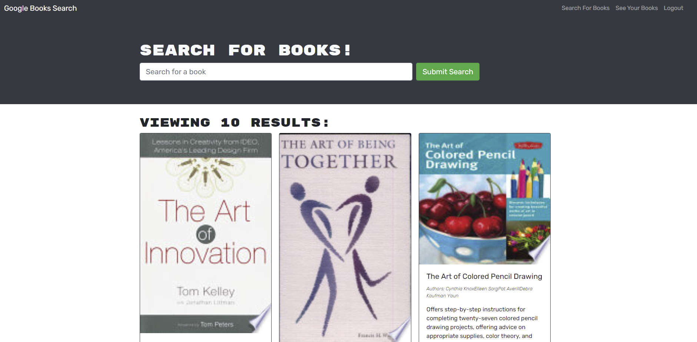

# Book Search 

## Description

The application is a tool used to search for books using Google's book search API. The application is built with a GraphQL API vs a traditional RESTful API. You can search for books and upon account creation, you can save books and delete them from your favorites.

## Table of Contents

- [Installation](#installation)
- [Usage](#usage)
- [License](#license)
- [Contributing](#contributing)
- [Screenshot-Link](#screenshot-link)

## Installation

No installation needed, please follow the link bellow to the deployed app.

## Usage

User can search books by name in the search field, the information will be pulled from google books API. If user chooses to create an account on the site than after log in the user will be able to save books to find them easyer in the future.
## License

### MIT

This application is covered under the MIT license. To learn more about this license,
please click the link. [MIT](https://choosealicense.com/licenses/mit/)

## Contributing

No contributions needed at this time.

Email Address: alexandru.naumov@gmail.com

[Deployed-Application](https://stark-sands-67562.herokuapp.com/)

## Screenshot-Link

